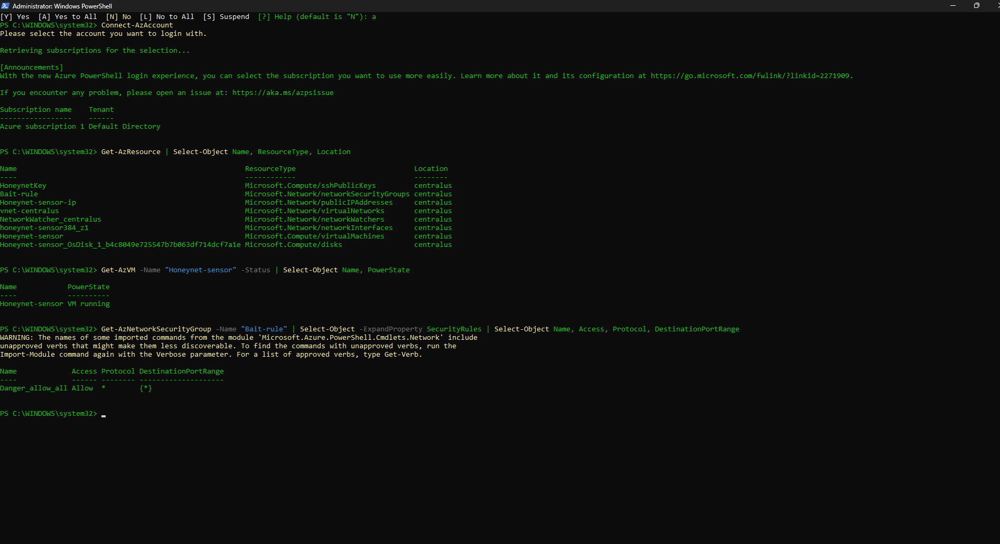
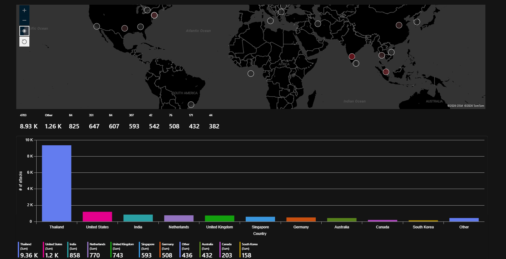
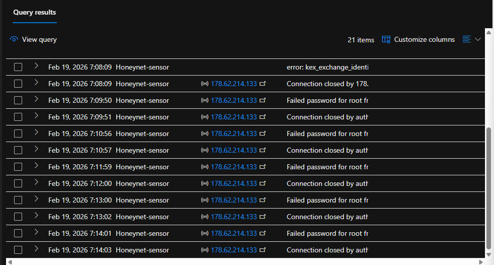

# Azure-Sentinel-Honeynet
a live cloud honey network used to ingest, analyze and visualize global attacks using sentinel and kql 

# Azure Cloud Honeynet and SOC Simulation

## Objective
This project involved the deployment of a live Honeynet in Microsoft Azure to observe and analyze global brute-force attacks in real-time. The core objective was to simulate a "misconfigured port" scenario—where a Linux server was exposed to the public internet—and use a Security Information and Event Management (SIEM) system to detect, investigate, and visualize the resulting threats.

## Project Narrative: Accidental Exposure Scenario
This lab simulates a common real-world risk: an engineer troubleshooting an application who opens Port 22 (SSH) and forgets to close the firewall rule before leaving for the day.
- **The Setup**: A Linux Virtual Machine was deployed with an intentionally vulnerable Network Security Group (NSG) rule named "Danger_allow_all".
- **The Result**: Within 30 minutes, automated botnets discovered the open port. Over a 21-hour period, the server was subjected to a continuous global bombardment of over 15,000 brute-force attempts.

## Technologies and Tools Used
- **Cloud Platform**: Microsoft Azure
- **SIEM**: Microsoft Sentinel
- **Log Management**: Log Analytics Workspace (Azure Monitor Agent)
- **Scripting**: PowerShell (Infrastructure as Code) and Kusto Query Language (KQL)
- **Operating System**: Linux (Ubuntu 22.04)

## Technical Implementation
1. **Infrastructure Deployment**: Used PowerShell to automate the creation of the Resource Group and the vulnerable Virtual Machine (VM).
2. **Log Ingestion**: Configured the Azure Monitor Agent (AMA) to forward Syslogs from the Linux VM to a Log Analytics Workspace.
3. **SIEM Integration**: Connected Microsoft Sentinel to the workspace to enable advanced threat detection and incident management.
4. **Threat Intelligence**: Utilized KQL to parse raw Syslogs, extracting geographic data from attacker IP addresses.
5. **Visualization**: Created custom Sentinel Workbooks to build a live global heatmap and a high-volume attack bar chart.

## Security Metrics (21-Hour Window)
| Metric | Result |
| :--- | :--- |
| **Total Security Incidents** | 50+ Unique Alerts |
| **Total Brute-Force Attempts** | 15,000+ Attempts |
| **Primary Target Account** | root |
| **Lead Attacker Source** | Thailand (9,360 Hits) |
| **Secondary Attacker Source** | United States (1,200 Hits) |
# Azure Cloud Honeynet and SOC Simulation

## Objective
This project involved the deployment of a live Honeynet in Microsoft Azure to observe and analyze global brute-force attacks in real-time. The core objective was to simulate a "misconfigured port" scenario—where a Linux server was exposed to the public internet—and use a Security Information and Event Management (SIEM) system to detect, investigate, and visualize the resulting threats.

## Project Narrative: Accidental Exposure Scenario
This lab simulates a common real-world risk: an engineer troubleshooting an application who opens Port 22 (SSH) and forgets to close the firewall rule before leaving for the day.

*Figure 1: Automated deployment of the Azure Honeynet and configuration of the intentionally vulnerable 'Danger_allow_all' Network Security Group (NSG) rule.*

- **The Setup**: A Linux Virtual Machine was deployed via PowerShell with an intentionally vulnerable NSG rule named "Danger_allow_all".
- **The Result**: Within 30 minutes, automated botnets discovered the open port. Over a 21-hour period, the server was subjected to over 15,000 brute-force attempts.

## Technologies and Tools Used
- **Cloud Platform**: Microsoft Azure
- **SIEM**: Microsoft Sentinel
- **Log Management**: Log Analytics Workspace (Azure Monitor Agent)
- **Scripting**: PowerShell (Infrastructure as Code) and Kusto Query Language (KQL)
- **Operating System**: Linux (Ubuntu 22.04)

## Technical Implementation
1. **Infrastructure Deployment**: Used PowerShell to automate the creation of the Resource Group and the vulnerable Virtual Machine (VM).
2. **Log Ingestion**: Configured the Azure Monitor Agent (AMA) to forward Syslogs from the Linux VM to a Log Analytics Workspace.

*Figure 2: Verifying the Azure Monitor Agent (AMA) heartbeat to ensure live log ingestion.*

3. **SIEM Integration**: Connected Microsoft Sentinel to the workspace to enable advanced threat detection and incident management.
4. **Threat Intelligence**: Utilized KQL to parse raw Syslogs, extracting geographic data from attacker IP addresses.

## Security Metrics (21-Hour Window)
| Metric | Result |
| :--- | :--- |
| **Total Security Incidents** | 256 Unique Alerts Triggered |
| **Total Brute-Force Attempts** | 15,000+ Attempts |
| **Primary Target Account** | root |
| **Lead Attacker Source** | Thailand (9,360 Hits) |
| **Secondary Attacker Source** | United States (1,200 Hits) |

## Forensic Analysis & Visualization
The final 21-hour window revealed a high-intensity global siege. The visual data confirms that once a port is exposed, discovery is near-instantaneous.

*Figure 3: Final 21-Hour Damage Report: A global heatmap and bar chart visualizing over 15,000 attempts, led by a massive 9.36K surge from Thailand.*

Analyzing the raw logs further provides proof of the automated nature of these attacks.

*Figure 4: Raw Syslog forensics: Analyzing high-frequency brute-force attempts targeting the 'root' account every minute.*

## Conclusion
This project demonstrates the critical importance of the Principle of Least Privilege. In a cloud environment, a single misconfiguration can be discovered and exploited by global botnets in minutes. 

## Key Findings and Analysis
- **Automation is Relentless**: The logs confirmed that these were not human actors, but automated botnets cycling through dictionary lists at a rate of multiple attempts per second.
- **Mean Time to Detection**: The server was discovered by reconnaissance scripts in less than 30 minutes.
- **Geographic Diversity**: While the primary attack volume originated from Thailand, the server was targeted by IPs in over 10 different countries within 24 hours.

## Conclusion
This project demonstrates the critical importance of the Principle of Least Privilege. In a cloud environment, a single misconfiguration can be discovered and exploited by global botnets in minutes. Microsoft Sentinel proved vital in providing the visibility necessary to identify the attack patterns and source locations that would otherwise remain hidden in raw log data.
