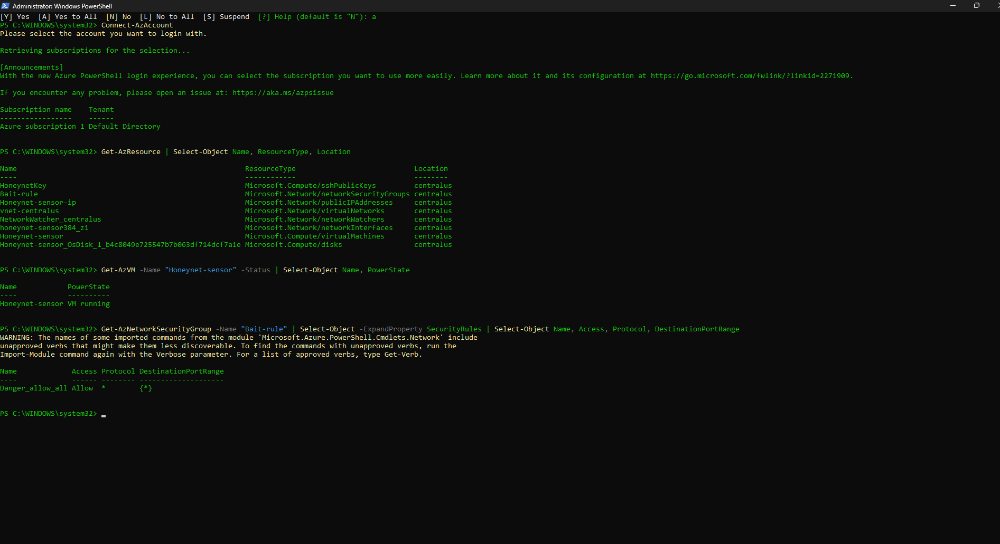
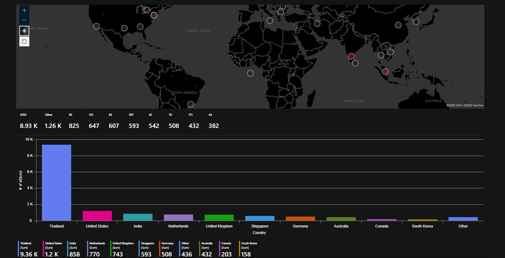
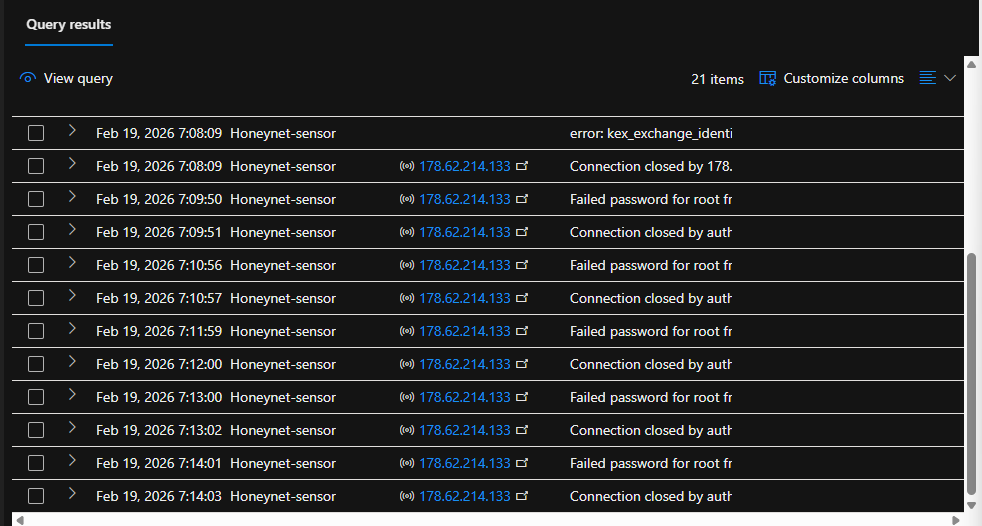

# Azure Sentinel Honeynet (SSH Brute-Force Telemetry)

Live Azure SSH honeynet: ingested Syslog into Microsoft Sentinel (AMA/Log Analytics), generated alerts, and visualized global brute-force activity with KQL

## What this project shows
- Built a cloud logging pipeline: **Linux Syslog → AMA → Log Analytics → Sentinel**
- Validated detections using raw log evidence (failed SSH attempts at scale)
- Used **KQL** to extract attacker IP patterns and visualize geography and volume
- Documented a repeatable workflow: deploy → ingest → detect → investigate → report

## Scenario
This lab simulates a realistic mistake: an engineer opens **Port 22 (SSH)** for troubleshooting and forgets to remove the rule.

- **Target:** Ubuntu 22.04 VM with a public IP  
- **Misconfiguration:** permissive NSG rule (ex: `Danger_allow_all`)  
- **Observation window:** ~21 hours  
- **Result:** continuous, automated brute-force attempts from multiple regions  

## Tools & Technologies
- **Cloud:** Microsoft Azure  
- **SIEM:** Microsoft Sentinel  
- **Logging:** Log Analytics Workspace + Azure Monitor Agent (AMA)  
- **OS:** Ubuntu 22.04  
- **Querying:** KQL  
- **Automation:** PowerShell (resource deployment)

## Implementation summary
- Deployed Azure resources (Resource Group, VM, NSG, Workspace)
- Enabled Syslog collection using AMA
- Connected the workspace to Microsoft Sentinel
- Queried and analyzed logs with KQL
- Built visualizations (map + top countries + volume trends)

## Results (21-hour window)
| Metric | Result |
|---|---|
| Unique alerts triggered | **256** |
| Brute-force attempts observed | **15,000+** |
| Primary account targeted | `root` |
| Highest attacker volume | Thailand (**9,360** hits) |
| Secondary attacker volume | United States (**1,200** hits) |

## Evidence (raw logs + incidents)
**Raw brute-force events in syslog:**  

**Sentinel incident/alert activity:**  

## Key findings
- **Exposure is discovered fast:** public SSH attracts automated scanning quickly
- **Attacks are high-volume and automated:** consistent with botnet/dictionary behavior
- **Dashboards accelerate triage:** geography + volume trends show patterns faster than raw logs alone

## Cleanup / safety note
This lab intentionally exposed SSH to the public internet for observation. After data collection, resources should be torn down (delete the Resource Group) to stop exposure and avoid ongoing costs.
